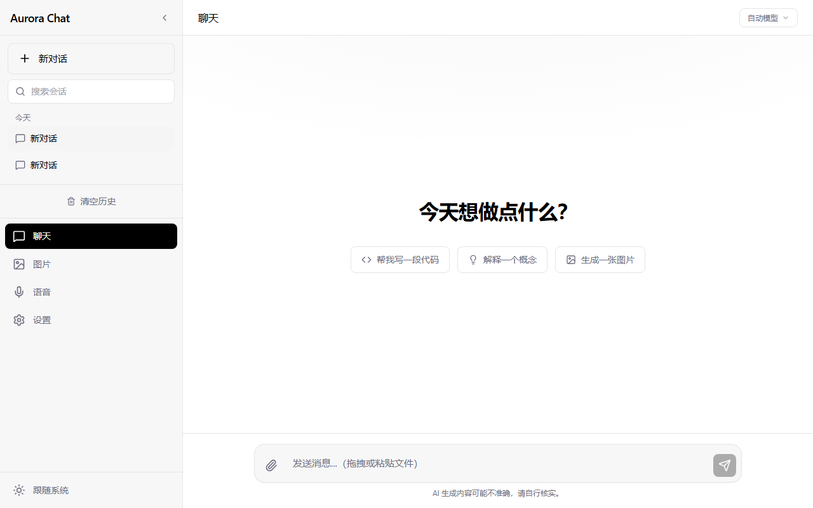
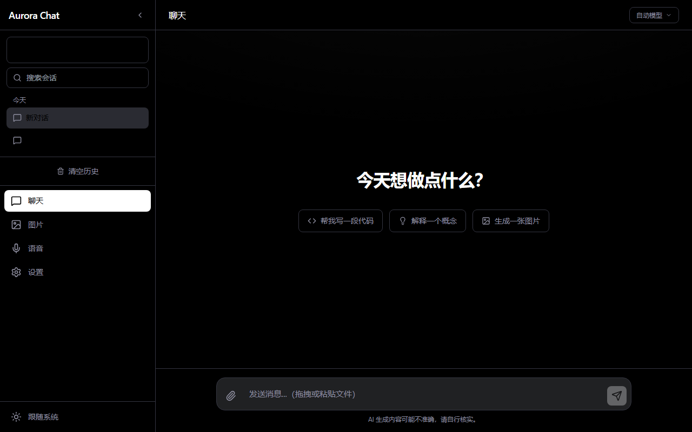
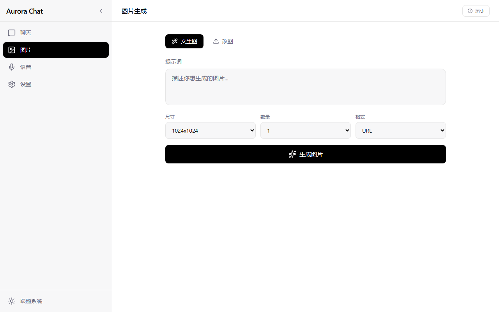
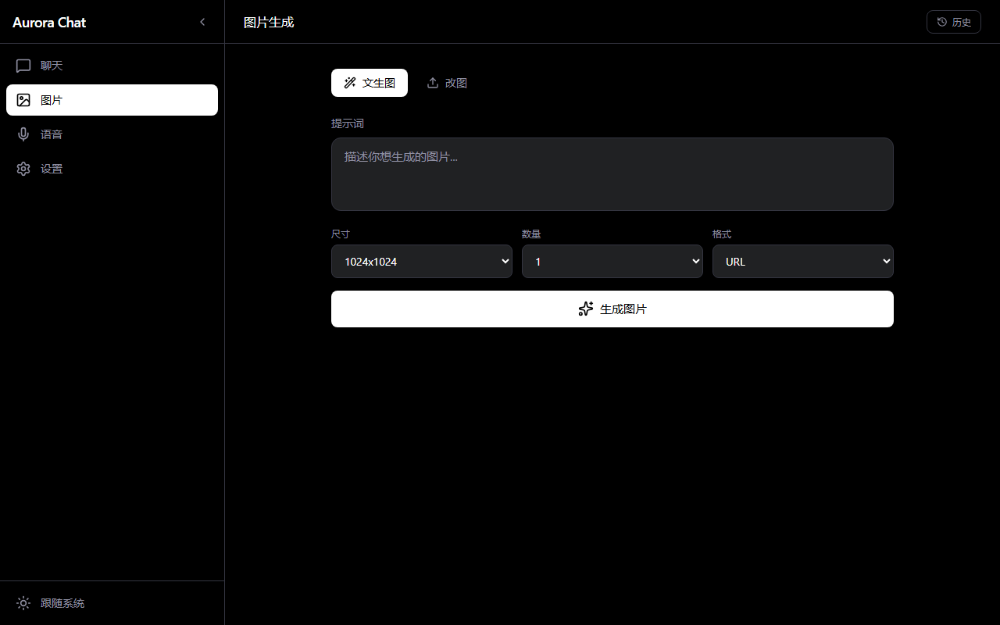
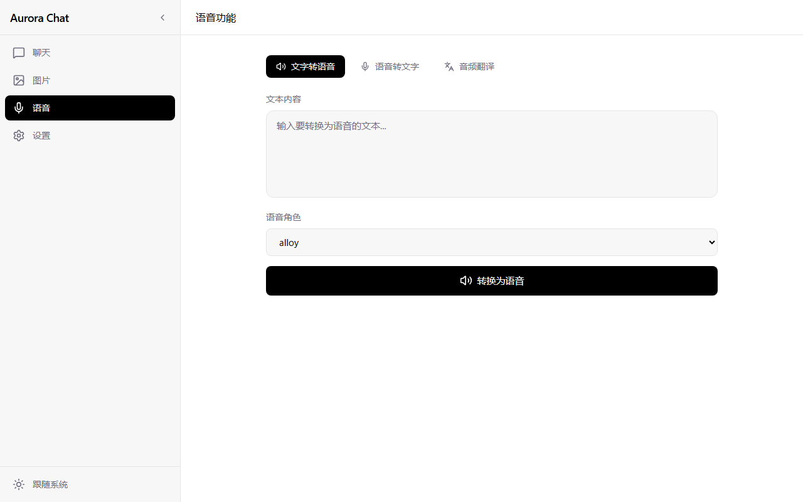
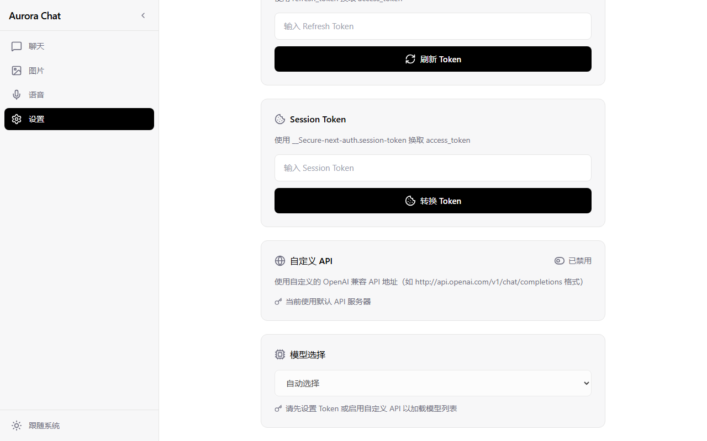
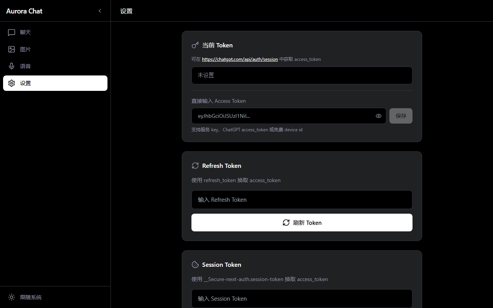

# Aurora Chat

一个为 [Aurora](https://github.com/aurora-develop/aurora) 后端服务打造的现代化 Web 前端，同时支持任意 OpenAI 兼容 API 端点，采用极简未来主义设计风格，参考 Apple 与 ChatGPT 的视觉语言。


## 功能特性

- 💬 **聊天对话**：支持 SSE 流式响应、Markdown 渲染、代码高亮、文件上传问答
- 🖼️ **图片生成**：文生图、改图、图生图，支持 URL / Base64 返回
- 🔊 **语音功能**：文字转语音（TTS）、语音转文字（STT）、音频翻译
- 🌐 **自定义 API**：支持任意 OpenAI 兼容 API（`/v1/chat/completions` 格式），如 OpenAI、Azure、Ollama、vLLM 等
- ⚙️ **灵活认证**：默认 API 支持 Access Token / Refresh Token / Session Token，自定义 API 支持 Bearer Token
- 🌓 **深色模式**：自动跟随系统偏好，支持浅色 / 深色 / 跟随系统
- 📱 **响应式布局**：桌面端可折叠侧边栏，移动端抽屉式导航
- ⚡ **代码分割**：按路由懒加载，首屏加载更快

## 界面预览

### 聊天页面

| 浅色模式 | 深色模式 |
|:---:|:---:|
|  |  |

### 图片生成

| 浅色模式 | 深色模式 |
|:---:|:---:|
|  |  |

### 语音功能



### 设置页面

| Token 与自定义 API | 深色模式 |
|:---:|:---:|
|  |  |

## 技术栈

- React 18 + TypeScript
- Vite 6
- Tailwind CSS
- Zustand（状态管理）
- lucide-react（图标）
- react-markdown + highlight.js（Markdown 与代码高亮）

## 快速开始

### 环境要求

- Node.js >= 18
- pnpm 或 npm
- （可选）Aurora 后端服务运行在本地的 `http://localhost:8080`；使用自定义 API 时无需后端

### 安装依赖

```bash
cd "D:\Node\Aurora Chat"
pnpm install
# 或 npm install
```

### 开发运行

```bash
pnpm dev
# 或 npm run dev
```

打开浏览器访问 `http://localhost:3000`

### 生产构建

```bash
pnpm build
# 或 npm run build
```

构建产物位于 `dist/` 目录。

### 部署到 Vercel

项目已内置 `vercel.json`，支持零配置部署：

1. 在 [vercel.com](https://vercel.com) 导入 Git 仓库，或安装 Vercel CLI：

   ```bash
   npm i -g vercel
   ```

2. 在项目根目录执行：

   ```bash
   vercel
   ```

3. 按提示确认项目配置，Vercel 会自动检测 Vite 框架并构建部署

后续推送代码到 main 分支时，Vercel 会自动触发重新部署。

> **提示**：部署到 Vercel 后，使用自定义 API 功能无需自建后端，直接在设置页面配置第三方 API 地址即可。

## 配置说明

### 默认 API（Aurora 后端）

#### 后端地址

默认代理到本地 `http://localhost:8080`。如需修改，编辑 `vite.config.ts`：

```ts
server: {
  proxy: {
    '/api': {
      target: 'http://your-server:8080',
      changeOrigin: true,
      rewrite: (path) => path.replace(/^\/api/, '')
    }
  }
}
```

#### API 基础地址

前端通过环境变量配置 API 基础地址（默认 `http://localhost:8080`）：

```env
VITE_API_BASE_URL=http://localhost:8080
```

创建 `.env` 文件并写入上述内容即可。

### 自定义 API（OpenAI 兼容端点）

Aurora Chat 支持连接任意遵循 OpenAI `/v1/chat/completions` 格式的 API 端点。启用后，所有请求（聊天、模型列表等）将直接发往自定义地址。

#### 支持的平台

- **OpenAI** — `https://api.openai.com`
- **Azure OpenAI** — `https://your-resource.openai.azure.com`
- **Ollama** — `http://localhost:11434`
- **vLLM** — `http://localhost:8000`
- **LM Studio** — `http://localhost:1234`
- **Together AI** — `https://api.together.xyz`
- **Groq** — `https://api.groq.com/openai`
- **DeepSeek** — `https://api.deepseek.com`
- **百度千帆** — `https://qianfan.baidubce.com/v2`
- **阿里百炼** — `https://dashscope.aliyuncs.com/compatible-mode`
- **硅基流动** — `https://api.siliconflow.cn`
- 以及其他兼容 OpenAI 接口规范的第三方平台

#### 配置方法

1. 打开应用，进入 **设置** 页面
2. 找到 **"自定义 API"** 区块，点击开关启用
3. 填入以下信息：
   - **API 基础地址**：API 的根域名，如 `https://api.openai.com`（程序自动追加 `/v1/chat/completions` 等路径）
   - **API 密钥**：API Key，如 `sk-...`
4. 点击 **"测试连接并加载模型"** 验证连通性并获取可用模型列表
5. 在模型下拉框中选择要使用的模型，即可开始对话

#### 认证方式

自定义 API 使用标准的 `Bearer Token` 认证方式（HTTP Header: `Authorization: Bearer <key>`），与 OpenAI 官方接口完全一致。

#### 切换 API

- 关闭"自定义 API"开关即可切回默认的 Aurora 后端
- 两种配置独立保存，互不干扰
- 聊天页顶部会显示 🌐 **自定义 API** 徽章，方便识别当前使用的 API 源

## 使用指南

### 方式一：使用 Aurora 后端（默认）

1. 启动 Aurora 后端服务
2. 启动前端开发服务器
3. 浏览器打开 `http://localhost:3000`
4. 进入 **设置** 页面
5. 选择以下任一方式设置 Token：
   - **直接输入 Access Token**：粘贴 `access_token`、服务 key 或 device id
   - **Refresh Token**：输入 `refresh_token` 自动换取
   - **Session Token**：输入 `__Secure-next-auth.session-token` 自动换取
6. 返回聊天页面开始使用

### 方式二：使用自定义 API

1. 启动前端开发服务器
2. 浏览器打开 `http://localhost:3000`
3. 进入 **设置** 页面
4. 找到 **"自定义 API"** 区块，开启开关
5. 填入 API 基础地址（如 `https://api.openai.com`）和 API 密钥
6. 点击 **"测试连接并加载模型"** 获取模型列表
7. 选择模型后返回聊天页面开始使用

## 支持的 Token 类型（默认 API）

| Token 类型 | 支持功能 |
|-----------|---------|
| 服务访问 key | 普通聊天 |
| ChatGPT access_token | 全部功能（聊天、文件、图片、语音） |
| UUID 免费 device id | 仅普通聊天 |

## 注意事项

- 文件上传、图片生成、TTS 等功能需要真实的 ChatGPT `access_token`（默认 API）
- 自定义 API 的功能范围取决于目标端点的实际能力
- 免费 UUID 账号仅支持普通聊天
- 后端服务需正确配置 CORS，Aurora 默认已启用

## 友链

- [linux.do](https://linux.do/)


## License

MIT
